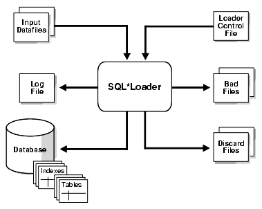
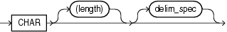

# 1. 官网地址

[Oracle Database](https://docs.oracle.com/en/database/oracle/oracle-database/index.html)

# 2. SQL * Loader 概述

SQL * Loader 将数据从外部文件加载到 Oracle 数据库表中, 对数据文件中的数据格式几乎没有限制, 批量数据的导入比传统的数据插入效率更高

## 2.1. SQL * Loader 原理图



### 2.1.1. 控制文件(Control File)

控制文件扩展名 `ctl`, 用于控制数据导入的行为方式

```text
load data                   -- 数据导入开始的标识
infile *                    -- 指定数据文件位置, *: 表示数据包含在控制文件中                               
into table table_name       -- 指定数据导入表名, 前提表必须存在, 在 into 前可以指定数据导入方式: INSERT, APPEND, TRUNCATE, REPLACE
fields terminated by ','    -- 指定数据文件中每条记录的分隔符, 以英文逗号分隔
(id,name,age)               -- 对应表的列名
begindata                   -- 数据包含在控制文件中时，使用 begindata 参数, 用于识别控制文件中的导入数据
1,Tom,23
2,Mary,24
```

### 2.1.2. 数据文件(Data Files)

数据文件文件默认扩展名 `dat`, 也支持 csv 和 txt 文件扩展名, 用于存放源数据的文件, 同一批次的数据可以配置为多个数据文件

```text
源数据既可以单独存放在数据文件中, 也可以存放在控制文件中
```

### 2.1.3. 日志文件(Log File)

日志文件扩展名 `log`，用于记录 SQL * Loader 在数据导入过程中产生的日志信息

```text
SQL * Loader 执行时, 会自动创建日志文件, 如果无法创建日志文件, 那么会终止执行导数操作
```

### 2.1.4. 错误文件(Bad File)

错误文件扩展名 `bad`, 用于记录无法正确导入的数据, 包括: 数据格式、数据类型等问题

```text
如果未指定错误文件并且产生错误记录, 那么 SQL * Loader 将自动创建与数据文件同名的错误文件
```

### 2.1.5. 废弃文件(Discard File)

废弃文件扩展名 `dsc`, 用于记录被逻辑条件(即 WHEN 子句)过滤掉的数据

```text
被逻辑条件过滤掉的数据, 并不是错误数据, 其数据本身的数据格式、数据类型等没有问题, 只是不符合过滤条件
```

### 2.1.6. 参数文件(Parameter File)

参数文件扩展名 `par`, 用于 sqlldr 的命令参数

```text
既可以单独存放在参数文件中, 也可以存放在控制文件中
```

## 2.2. SQL * Loader 保留字

SQL * Loader 的保留字必须在双引号内指定, SQL * Loader 保留字是 `CONSTANT` 和 `ZONE`

# 3. SQL * Loader 数据位置

## 3.1. 控制文件中包含数据

**建表语句**

```sql
create table test1
(
    id   int,
    name varchar2(20),
    age  int
);
```

**控制文件**: test1.ctl

```text
load data 
infile *
into table test1
fields terminated by ','
(id,name,age)
begindata
1,Tom,23
2,Mary,24
```

**执行命令**

```text
sqlldr test/123456 control=test1.ctl
```

### 3.1.1. 控制文件和数据文件

**建表语句**

```sql
create table test2
(
    id   int,
    name varchar2(20),
    age  int
);
```

**数据文件**: test2.dat

```text
1,Tom,23
2,Mary,24
```

**控制文件**: test2.ctl

```text
load data 
infile test2.dat
into table test2
fields terminated by ','
(id,name,age)
```

**执行命令**

```text
sqlldr test/123456 control=test2.ctl
```

# 4. SQL * Loader 基本用法

## 4.1. 导入固定格式记录

数据文件中所有记录的字节长度都相同, 即为固定格式记录, 固定格式记录的灵活性最差, 但性能最好

**语法**

```text
infile datafile_name "fix n"
```

fix n: 表示数据文件中, 每条记录的长度都为 n 个字节, 包括: 换行符

**建表语句**

```sql
create table test3
(
    col1 char(9),
    col2 char(9)
);
```

**数据文件**: test3.dat

```text
396,...ty..4922,beth..68773,ben..1,.."dave..5455,mike.
001,...cd..0002,fghi.
00003,lmn.
1,."pqrs".
0005,uvwx.

```

**控制文件**: test3.ctl

```text
load data 
infile test3.dat "fix 11"   -- 表示连续取 11 个字节包括换行符, 作为一行数据
into table test3
fields terminated by ','
(col1,col2)
```

**执行命令**

```text
sqlldr test/123456 control=test3.ctl
```

## 4.2. 导入可变格式记录

数据文件中每条记录的开头都包含记录的长度, 即为可变格式记录, 可变格式记录分为两部分: `记录长度` 和 `记录本身`

**语法**

```text
infile datafile_name "var n"
```

var n: 表示数据文件中, 指定记录长度的字节数, 如果未指定 n, 那么 SQL * Loader 默认长度为 5 个字节, n 大于 40 报错

**建表语句**

```sql
create table test4
(
    col1 char(5),
    col2 char(7)
);
```

**数据文件**: test4.dat

```text
009hello,cd,010world,im,
012my,name is,

```

**控制文件**: test4.ctl

```text
load data 
infile test4.dat "var 3"    -- 表示记录的前三位为该记录长度的字节数
into table test4
fields terminated by ','
(col1,col2)
```

**执行命令**

```text
sqlldr test/123456 control=test4.ctl
```

## 4.3. 导入流式格式记录

数据文件中记录没有指定大小, 即为流式格式记录, 流式格式记录是最灵活的方式, 但会对性能产生负面影响

```text
流式格式记录是 SQL * Loader 默认导入方式, 通过扫描每条记录的终止符形成记录, 终止符后的数据会全部舍去
```

**语法**

```text
infile datafile_name ["str terminator_string"]
```

- str: 关键字
- terminator_string: 终止符, 分为: 'char_string'(单引号或双引号字符串)或 X'hex_string'(十六进制格式字节字符串)

```text
当 terminator_string 包含不可打印字符时, 应将其指定为 X'hex_string', 但某些不可打印字符可以通过使用反斜杠指定为 'char_string'
    \n: 换行符
    \t: 水平制表符
    \f: 换页符
    \v: 垂直制表符
    \r: 回车
```

- 在基于 UNIX 的平台上, 如果指定 no terminator_string, 那么 SQL * Loader 默认 \n 为终止符
- 在 Windows NT 平台上, 如果指定 no terminator_string, 那么 SQL * Loader 默认 \n 或 \r\n 为终止符

**建表语句**

```sql
create table test5
(
    col1 char(5),
    col2 char(7)
);
```

**数据文件**: test5.dat

```text
hello, world,|
james,bond,|
```

**控制文件**: test5.ctl

```text
load data 
infile test5.dat "str '|\n'"    -- 指定 '|\n' 作为每条记录的终结符
into table test5
fields terminated by ','
(col1,col2)
```

**执行命令**

```text
sqlldr test/123456 control=test5.ctl
```

# 5. SQL * Loader 对不同文件及格式的处理方法

## 5.1. 数据文件被分隔符分隔后, 数据中包含其他符号

可以使用 `TERMINATED BY`, `ENCLOSED BY` 和 `OPTIONALLY ENCLOSED BY` 子句指定分隔符

```text
如果使用 TERMINATED BY 子句, 那么必须排在第一位使用
```

- TERMINATED: 读取数据, 直到第一次出现错误
- BY: 增加可读性
- WHITESPACE: 空白字符, 包括: 空格、制表符、换行符、换页符或回车符, `仅与 TERMINATED 一起使用`
- ENCLOSED: 找到一个或多个连续的且由分隔符左右包裹的数据
- AND: 负责左右包裹的分隔符不同时, 可以指定不同的分隔符, 如果不存在 AND, 那么分隔符必须相同
- OPTIONALLY: 有, 只对字符串类型的字段使用左右包裹; 无, 对全部字段使用左右包裹

**建表语句**

```sql
CREATE TABLE test6
(
    "ENAME" VARCHAR2(10),
    "JOB"   VARCHAR2(9),
    "SAL"   NUMBER,
    "COMM"  NUMBER
);
```

**数据文件**: test6.dat

```text
SMITH,CLEAK,3904 
ALLEN,"SALER,M",2891
WARD,"SALER,""S""",3128
KING,PRESIDENT,2523
```

**控制文件**: test6.ctl

```text
load data 
infile test6.dat
into table test6
fields terminated by ',' OPTIONALLY ENCLOSED BY '"'
(ENAME,JOB,SAL)
```

**执行命令**

```text
sqlldr test/123456 control=test6.ctl
```

## 5.2. 数据文件没有分隔符

**建表语句**

```sql
CREATE TABLE test7
(
    "ENAME" VARCHAR2(10),
    "JOB"   VARCHAR2(9),
    "SAL"   NUMBER,
    "COMM"  NUMBER
);
```

**数据文件** test7.dat

```text
SMITH   CLEAK       3904
ALLEN   SALESMAM    2891
WARD    SALESMAN    3128
KING    PRESIDENT   2523
```

**控制文件**: test7.ctl

```text
load data 
infile test7.dat
into table test7
(
ENAME position(1:5),    -- position(1:5) 或 position(1-5): 指定数据字段的位置
JOB position(9:17),
SAL position(21:24)
)
```

**执行命令**

```text
sqlldr test/123456 control=test7.ctl
```

## 5.3. 数据文件的列比目标表的列少

**建表语句**

```sql
CREATE TABLE test8
(
    "ENAME" VARCHAR2(10),
    "JOB"   VARCHAR2(9),
    "SAL"   NUMBER,
    "COMM"  NUMBER
);
```

**数据文件**: test8.dat

```text
SMITH   CLEAK       3904
ALLEN   SALESMAM    2891
WARD    SALESMAN    3128
KING    PRESIDENT   2523
```

**控制文件**: test8.ctl

- 方式一

```text
load data 
infile test8.dat
into table test8
(
ENAME position(1:5),    -- position(1:5) 或 position(1-5)
JOB position(9:17),
SAL position(21:24),
COMM "0"                -- 赋值默认值
)
```

- 方式二

```text
load data 
infile test8.dat
append into table test8
(
ENAME position(1:5),    -- position(1:5) 或 position(1-5)
JOB position(9:17),
SAL position(21:24),
COMM "substr(:SAL,1,1)" -- 使用表达式, 截取薪水的一部分
)
```

**执行命令**

```text
sqlldr test/123456 control=test8.ctl
```

## 5.4. 数据文件的列比目标表的列多

**建表语句**

```sql
CREATE TABLE test9
(
    "ENAME" VARCHAR2(10),
    "JOB"   VARCHAR2(9),
    "SAL"   NUMBER,
    "COMM"  NUMBER
);
```

**数据文件**: test9.dat

```text
姓名   职位  老板号 月薪 部门号
SMITH,CLERK,7902,800,20
ALLEN,SALESMAN,7698,1600,30
WARD,SALESMAN,7698,1250,30
JONES,MANAGER,7839,2975,20
MARTIN,SALESMAN,7698,1250,30
BLAKE,MANAGER,7839,2850,30
CLARK,MANAGER,7839,2450,10
SCOTT,ANALYST,7566,3000,20
KING,PRESIDENT,NULL,5000,10
TURNER,SALESMAN,7698,1500,30
ADAMS,CLERK,7788,1100,20
JAMES,CLERK,7698,950,30
FORD,ANALYST,7566,3000,20
MILLER,CLERK,7782,1300,10
```

**控制文件**: test9.ctl

- 方式一

修改数据文件, 删除多余的数据(列), 适用于数据量小的数据文件

- 方式二

```text
load data 
infile test9.dat
into table test9
fields terminated by ','
(
ENAME,
JOB,
XCOL FILLER,    -- FILLER: 过渡掉数据文件中不需要的列, XCOL 为占位符, 没有使用 FILLER 的列 sqlldr 会默认跳过, 使用也是可以的
SAL,
COMM "0"   
)
```

**执行命令**

```text
sqlldr test/123456 control=test9.ctl
```

## 5.5. 多个数据文件导入同一张目标表中

INFILE: 指定数据文件位置, 支持数据文件扩展名: dat、csv 和 txt

- 数据包含在控制文件中, INFILE *
- 指定数据文件的全路径, INFILE 'c:/topdir/subdir/datafile.dat'
- 多个数据文件导入到同一张表中

```text
INFILE  mydat1.dat  BADFILE  mydat1.bad  DISCARDFILE mydat1.dis
INFILE  mydat2.dat  "RECSIZE 80 BUFFERS 8"
INFILE  mydat3.dat  DISCARDFILE  mydat3.dis
INFILE  mydat4.dat  DISCARDMAX  10 0
```

**建表语句**

```sql
CREATE TABLE student
(
    sid   int,
    ename varchar2(20),
    age   int
);
```

**数据文件**

- student01.dat

```text
1,TOM,23
2,MARY,20
```

- student02.dat

```text
3,JERRY,21
```

**控制文件**: student.ctl

```text
load data 
infile student01.dat    -- infile student01.dat badfile student01.bad discardfile student01.dsc
infile student02.dat    -- infile student02.dat badfile student02.bad discardfile student02.dsc
into table student
fields terminated by ','
(sid,ename,age)
```

**执行命令**

```text
sqlldr test/123456 control=student.ctl
```

## 5.6. 同一个数据文件导入不同目标表中

WHEN 子句出现在表名后, 可以包含多个条件, 每个条件之间使用 AND 连接, 括号可选, 举例: WHEN (deptno = '10') AND (job = 'SALES')

**建表语句**

```sql
CREATE TABLE test10_1
(
    mgrno number,
    mname varchar2(20),
    job   varchar2(20)
);
```

```sql
CREATE TABLE test10_2
(
    "ENAME" VARCHAR2(10),
    "JOB"   VARCHAR2(9),
    "SAL"   NUMBER,
    "COMM"  NUMBER
);
```

**数据文件**: test10.dat

```text
BON SMITH   CLERK       3904
BON	ALLEN   SALER,M     2891
BON	WARD    SALER,"S"   3128
BON KING    PRESIDENT   2523
MGR 10 SMITH    SALES   MANAGER
MGR 11 ALLEN.W  TECH    MANAGER
MGR 16 BLAKE    HR      MANAGER
TMP SMITH   7369 CLERK      1020 20
TMP ALLEN   7499 SALESMAN   1930 30
TMP WARD    7521 SALESMAN   1580 30
TMP JONES   7566 MANAGER    3195 20
```

**需求**

1. 将 MGR 开头的数据, 导入 test10_1 表中
2. 将 BON 开头的数据, 导入 test10_2 表中
3. 将 TMP 开头的数据, 存放到废弃文件中(dsc)

**控制文件**: test10.ctl

```text
load data 
infile test10.dat
discardfile test10.dsc
into table test10_2 WHEN TAB = 'BON'
(
TAB FILLER POSITION(1:3),
ENAME POSITION(5:9),
JOB POSITION(13:21),
SAL POSITION(25:28)
)
into table test10_1 WHEN TAB = 'MGR'
(
TAB FILLER POSITION(1:3),
MGRNO POSITION(5:6),
MNAME POSITION(8:14),
JOB POSITION(17:31)
)
```

**执行命令**

```text
sqlldr test/123456 control=test10.ctl
```

# 6. SQL * Loader 导入大数据

## 6.1. 大字段(LOB 类型)导入

SQL * Loader 支持以下类型的 LOB:

- BLOB: 非结构化二进制数据
- CLOB: 字符数据 
- NCLOB: 国家字符集字符 
- BFILE: 存储在数据库表空间之外的服务器端操作系统文件中的 BLOB

### 6.1.1. 方式一

在控制文件中, 显示指明数据 LOB 的长度

```text
注意: 如果不显示指明 LOB 的长度, Oracle 默认所有输入字段的长度为 char(255)
```

**建表语句**

```sql
CREATE TABLE test11
(
    product_name varchar2(20),
    description  clob
);
```

**数据文件**: test11.dat

```text
Rubik,This column contains a lot of description about the Rubik Cube.
Toy,This column contains a lot of description about the Toy.
```

**控制文件**: test11.ctl

```text
load data 
infile test11.dat
into table test11
fields terminated by ','
(product_name,description char(100000))
```

**执行命令**

```text
sqlldr test/123456 control=test11.ctl
```

### 6.1.2. 方式二

- LOBFILE: SQL * Loader 函数
- TERMINATED BY EOF: 表示每行的每个 lob 字段, 都来自一个独立的文件

**建表语句**

```sql
CREATE TABLE test_lobfile
(
    fileowner varchar2(20),
    filename  varchar2(200),
    filesize  number,
    filedata  clob
);
```

**数据文件**: test_lobfile.dat

```text
用户名 文件大小 文件全路径名
oracle,110,C:/test/test11/test11.ctl
oracle,1367,C:/test/test11/test11.log
```

**控制文件**: test_lobfile.ctl

```text
load data 
infile test_lobfile.dat
into table test_lobfile
fields terminated by ','
(fileowner,filesize,filename,filedata LOBFILE(filename) TERMINATED BY EOF)
```

**执行命令**

```text
sqlldr test/123456 control=test_lobfile.ctl
```

## 6.2. 百万级数据的导入

**建表语句**

```sql
CREATE TABLE test12
(
    prodName varchar2(100),
    cusName  varchar2(100)
);
```

**数据文件**: 202303241912.csv

生成百万级别的数据文件, 用户: sh, 表: sales, 数据量: 92 万

```sql
-- 多表查询语句
SELECT count(*)
FROM (SELECT p.PROD_NAME                                  AS prod_name,
             c.CUST_FIRST_NAME || ' ' || c.CUST_LAST_NAME AS cus_name
      FROM PRODUCTS p,
           SALES s,
           CUSTOMERS c
      WHERE p.PROD_ID = s.PROD_ID
        AND s.CUST_ID = c.CUST_ID);
```

**控制文件**: test12.ctl

```text
load data 
infile test12.csv
into table test12
fields terminated by ','
(prodName,cusName)
```

**执行命令**

```text
sqlldr test/123456 control=test12.ctl
```

### 6.2.1. 百万数据导入效率提升

**设置 rows 参数**

sqlldr 命令行的 rows 参数, 默认: 64 rows, 即每 64 行记录提交一次

```text
sqlldr test/123456 control=test12.ctl rows=640
```

rows 参数设置为 640 没有意义, SQL * Loader 会自动修改 rows 参数为 496, 因为 496 是 SQL * Loader 导入数据的最佳参数值

**设置 direct 参数**

direct=true 直接路径导入, 跳过数据的逻辑结构

```text
sqlldr test/123456 control=test12.ctl rows=640 direct=true
```

**禁用索引**

如果目标表上存在索引, 那么禁用索引也可以提升数据导入的效率

### 6.2.2. PHONE_INFO 案例

**建表语句**

```sql
-- Create table
create table PHONE_INFO
(
   prefix       VARCHAR2(10),
   mobile       VARCHAR2(10) not null,
   province     VARCHAR2(40),
   city         VARCHAR2(40),
   isp          VARCHAR2(40),
   areacode     VARCHAR2(40),
   postcode     VARCHAR2(40),
   provincecode VARCHAR2(40),
   citycode     VARCHAR2(40),
   lng          VARCHAR2(40),
   lat          VARCHAR2(40)
);

-- Add comments to the table 
comment on table PHONE_INFO is '手机号对应的地址表';

-- Add comments to the columns 
comment on column PHONE_INFO.prefix is '号段前三位';
comment on column PHONE_INFO.mobile is '号段(前7位)';
comment on column PHONE_INFO.province is '省';
comment on column PHONE_INFO.city is '市';
comment on column PHONE_INFO.isp is '运营商';
comment on column PHONE_INFO.areacode is '区号';
comment on column PHONE_INFO.postcode is '邮政编码';
comment on column PHONE_INFO.provincecode is '省行政区划代码';
comment on column PHONE_INFO.citycode is '市行政区划代码';
comment on column PHONE_INFO.lng is '市经度';
comment on column PHONE_INFO.lat is '市纬度';

-- Create/Recreate primary, unique and foreign key constraints 
alter table PHONE_INFO add constraint 前七位 primary key (MOBILE);
```

**数据文件**: phone_info.txt

数据量: 46 万

**控制文件**: phone_info.ctl

```text
load data
CHARACTERSET UTF8
infile 'C:/test/phone_info.txt'
append into table phone_info
Fields terminated by ","
(prefix,mobile,province,city,isp,areacode,postcode,provincecode,citycode,lng,lat)
```

**执行命令**

```text
sqlldr test/123456 control=phone_info.ctl rows=640 direct=true
```

# 7. 字符集

## 7.1. 数据库字符集

如果数据文件的字符集和数据库的字符集不一样, 那么 SQL * Loader 会自动将数据文件的字符集转换成数据库的字符集

```text
转换的前提条件是数据库字符集是数据文件字符集的超集
```

## 7.2. 数据文件字符集

使用 NLS_LANG 参数或指定控制文件的 CHARACTERSET 参数来设置数据文件的字符集

## 7.3. 输入字符转换

数据文件中的字符集, 在控制文件中使用 CHARACTERSET 参数进行指定, `进行数据字符集转换时, 目标表字符集应该是数据文件字符集的超集`

```text
如果未指定 CHARACTERSET 参数, 那么所有数据文件的默认字符集使用 NLS_LANG 参数定义的会话字符集
```

### 7.3.1. 查询数据库字符集

**方式一**

```sql
select * from nls_database_parameters;
```

环境变量 NLS_LANG 由以下三部分组成

1. NLS_LANGUAGE
2. NLS_TERRITORY
3. NLS_CHARACTERSET

**方式二**

```sql
select userenv('language') from dual;
```

### 7.3.2. CHARACTERSET 配置

数据文件字符集, 通过控制文件中的 CHARACTERSET 参数进行配置

**语法**

```text
CHARACTERSET char_set_name  -- char_set_name: 字符集名称, 通常指定的字符集名称必须是 Oracle 支持的字符集, UTF8 是 ZHS16GBK 的严格超集
```

# 8. SQL * Loader 控制文件

SQL * Loader 中最重要的文件是控制文件, 扩展名为 `ctl`

```text
OPTIONS
LOAD DATA
INFILE data_file_name
BADFILE bad_file_name
DISCARDFILE discard_file_name
[INSERT | REPLACE | TRUNCATE | APPEND]
INTO TABLE table_name 
WHEN field_conditions AND field_conditions
FIELDS TERMINATED BY 'delimiter' | TERMINATED BY WRITESPACE {[OPTIONALLY] ENCLOSED BY 'delimiter' AND 'delimiter'}
TRAILING NULLCOLS
===========================
BEGINDATA
10,Sql,what
20,lg,show
===========================
(
column_name POSITION(start:end) datatype,
column_name POSITION(start-end) datatype,
column_name datatype TERMINATED BY WRITESPACE,
column_name datatype TERMINATED BY 'delimiter' [OPTIONALLY ENCLOSED BY 'delimiter' AND 'delimiter'],
column_name FILLER datatype {TERMINATED BY 'delimiter' [OPTIONALLY ENCLOSED BY 'delimiter' AND 'delimiter']},
column_name datatype NULLIF condition AND  [AND condition...],
column_name datatype ":column_name * 100",
column_name datatype "UPPER(:column_name)",
column_name datatype "substr(:column_name, start, end)",
column_name datatype "RTRIM(:column_name)",
column_name datatype "NVL(:column_name, 0),
column_name datatype "TO_NUMBER(:column_name)",
column_name datatype "TO_NUMBER(:column_name)/num",
column_name datatype "TO_NUMBER(NVL(:price,0))/num",
column_name datatype "GREATEST(TO_NUMBER(:column_name)/num, TO_NUMBER(:column_name * num))",
column_name "replace(:column_name, '\\n', datatype)",
column_name EXPRESSION "SQL string",
column_name SYSDATE,
column_name datatype column_name CONSTANT {string | "string"},
column_name LOBFILE(column_name) TERMINATED BY EOF
```

## 8.1. OPTIONS 子句

OPTIONS 子句位于 LOAD DATA 子句之前

```text
BINDSIZE = n
COLUMNARRAYROWS = n
DATE_CACHE = n
DIRECT = {TRUE | FALSE} 
ERRORS = n
EXTERNAL_TABLE = {NOT_USED | GENERATE_ONLY | EXECUTE}
FILE
LOAD = n 
MULTITHREADING = {TRUE | FALSE}
PARALLEL = {TRUE | FALSE}
READSIZE = n
RESUMABLE = {TRUE | FALSE}
RESUMABLE_NAME = 'text string'
RESUMABLE_TIMEOUT = n
ROWS = n 
SILENT = {HEADER | FEEDBACK | ERRORS | DISCARDS | PARTITIONS | ALL} 
SKIP = n   
SKIP_INDEX_MAINTENANCE = {TRUE | FALSE}
SKIP_UNUSABLE_INDEXES = {TRUE | FALSE}
STREAMSIZE = n
```

**举例**

```text
OPTIONS (BINDSIZE=100000, SILENT=(ERRORS, FEEDBACK))
```

## 8.2. LOAD DATA

数据导入开始的标识

## 8.3. INFILE 子句

指定数据文件位置, 支持数据文件扩展名: dat、csv 和 txt

- 数据包含在控制文件中, INFILE *
- 指定数据文件的全路径

```text
INFILE 'c:/topdir/subdir/datafile.dat'  -- Windows
INFILE '/home/oracle/topdir/subdir/datafile.dat'    -- Unix
```

- 模糊匹配数据文件, 通配符 *: 复数字符; ?: 单个字符

```text
INFILE 'emp*.dat'
INFILE 'm?emp.dat'
```

- 多个数据文件导入到同一张表中

```text
INFILE  mydat1.dat  BADFILE  mydat1.bad  DISCARDFILE mydat1.dis
INFILE  mydat2.dat  "RECSIZE 80 BUFFERS 8"
INFILE  mydat3.dat  DISCARDFILE  mydat3.dis
INFILE  mydat4.dat  DISCARDMAX  10 0
```

## 8.4. BADFILE(可选)

指定错误文件位置, 存储符合条件但导入失败的数据, 缺省将在当前目录下生成与控制文件同名的 bad 文件

## 8.5. DISCARDFILE(可选)

指定废弃文件位置, 存储不符合条件且导入失败的数据, 缺省将在当前目录下生成与控制文件同名的 dsc 文件

## 8.6. INTO TABLE

指定数据导入表名, 前提表必须存在, 在 into 前可以指定数据导入方式: INSERT, APPEND, TRUNCATE, REPLACE

- INSERT: 默认导入方式, 目标表必须是空表, 否则报错
- APPEND: 在目标表上追加新数据
- TRUNCATE: 导入数据前, 先执行 TRUNCATE TABLE table_name REUSE STORAGE 语句, 清空目标表
- REPLACE: 导入数据前, 会先执行 DELETE FROM TABLE 语句, 清空目标表

## 8.7. WHEN

指定一个或多个字段条件, SQL * Loader 根据这些字段条件决定是否导入数据

- WHEN field_conditions AND field_conditions

## 8.8. TERMINATED BY, ENCLOSED BY 和 OPTIONALLY ENCLOSED BY

`TERMINATED BY`, `ENCLOSED BY` 和 `OPTIONALLY ENCLOSED BY` 子句指定分隔符

- TERMINATED: 读取数据, 直到第一次出现错误
- BY: 增加可读性
- WHITESPACE: 空白字符, 包括: 空格、制表符、换行符、换页符或回车符, `仅与 TERMINATED 一起使用`
- ENCLOSED: 找到一个或多个连续的且由分隔符左右包裹的数据
- AND: 负责左右包裹的分隔符不同时, 可以指定不同的分隔符, 如果不存在 AND, 那么分隔符必须相同
- OPTIONALLY: 有, 只对字符串类型的字段使用左右包裹; 无, 对全部字段使用左右包裹

```text
如果使用 TERMINATED BY 子句, 那么必须排在第一位使用
```

- FIELDS TERMINATED BY 'delimiter': 指定数据文件的全局分隔符, 要求每条记录分隔符一致 
- OPTIONALLY ENCLOSED BY 'delimiter': 找到一个或多个连续的且由分隔符左右包裹的字符串类型的字段 

## 8.9. TRAILING NULLCOLS

全局指定数据文件的字段是空值时, 目标表的对应字段允许插入 null

## 8.10. BEGINDATA

INFILE 导入数据包含在控制文件中, 所以使用 BEGINDATA 参数, 用于识别控制文件中的导入数据

- BEGINDATA 语句行中, 不要使用空格或其他字符, 否则 BEGINDATA 行将被认为是第一行数据
- 不要将注释信息放在 BEGINDATA 后, 否则被认为是数据

## 8.11. column_name

**SYSDATE**

column_name SYSDATE: 设置列的值为当前日期

### 8.11.1. POSITION

- column_name POSITION (start:end): 指定数据字段位置
- column_name POSITION (start-end): 指定数据字段位置
- column_name POSITION (start:end) datatype: 指定数据字段位置, 并指定字段的数据类型
- column_name POSITION (*-end) datatype, *: 表示截取字段的开始位置是上个字段的结束位置

**举例**

```text
column_name POSITION(3:10) char(8)
```

### 8.11.2. TERMINATED BY & OPTIONALLY ENCLOSED BY

如果未声明全局 FIELDS TERMINATED BY 'delimiter' 子句, 那么可以为每列记录指定单独的分隔符子句

- column_name datatype TERMINATED BY 'delimiter' [OPTIONALLY ENCLOSED BY 'delimiter' AND 'delimiter']
- column_name TERMINATED BY 'delimiter': 数据文件中, 每列记录指定单独的分隔符
- column_name datatype TERMINATED BY 'delimiter': 数据文件中, 每列记录指定单独的分隔符, 并指定字段的数据类型

**举例**

```text
column_name interger external TERMINATED BY ',',
column_name date "dd-mon-yyy" TERMINATED BY ',',
column_name char TERMINATED BY WRITESPACE, -- 以空白字符分隔
column_name char TERMINATED BY ',' ENCLOSED BY '(' AND ')'
```

### 8.11.3. FILLER

排除数据文件中不需要被导入的列数据

column_name FILLER datatype {TERMINATED BY 'delimiter' [OPTIONALLY ENCLOSED BY 'delimiter' AND 'delimiter']}

### 8.11.4. NULLIF

如果需要将每列记录的空白字段单独设为 null, 那么可以使用 NULLIF 子句

column_name datatype NULLIF condition AND  [AND condition...]

**举例**

```text
column_name POSITION (1:3) INTEGER EXTERNAL NULLIF column_name=BLANKS   -- BLANKS: 表示空白(不包括 tab), 如果 column_name=BLANKS, 那么该字段设为 NULL
```

### 8.11.5. ":column_name * num"

column_name datatype ":column_name * num": 取到的值 * num

### 8.11.6. "UPPER(:column_name)"

column_name datatype "UPPER(:column_name)": 转为大写

### 8.11.7. "substr(:column_name, start, end)"

column_name datatype "substr(:column_name, start, end)": 截取

### 8.11.8. "RTRIM(:column_name)"

column_name datatype "RTRIM(:column_name)": 去掉空格

### 8.11.9. "NVL(:column_name, 0)"

column_name datatype "NVL(:column_name, 0)": NVL

### 8.11.10. "TO_NUMBER(:column_name)/100"

- column_name datatype "TO_NUMBER(:column_name)": 转数字
- column_name datatype "TO_NUMBER(:column_name)/100": 转数字计算
- column_name datatype "TO_NUMBER(NVL(:price,0))/100": 转数字计算

### 8.11.11. "GREATEST(TO_NUMBER(:column_name)/100, TO_NUMBER(:column_name * 0.10))"

column_name datatype "GREATEST(TO_NUMBER(:column_name)/100, TO_NUMBER(:column_name * 0.10))": 取最大值

### 8.11.12. "replace(:column_name, '\\n', datatype)"

column_name "replace(:column_name, '\\n', datatype)": 替换

### 8.11.13. EXPRESSION "SQL string"

column_name EXPRESSION "SQL string": 设置列的值为表达式的值

### 8.11.14. 自动生成字段值

- column_name RECNUM: 递增数值从 1 开始
- column_name CONSTANT {string | "string"}: 插入指定常量值, 而非从数据文件中读取的数据
- column_name SEQUENCE ({integer | MAX | COUNT} [,increment]): 设置列的值为唯一序列数字, 效果与 RECNUM 差不多, 可以设置开始值
   - increment: 序列增加步长, 默认值为 1
   - MAX: 该序列从表中的当前最大值上开始增加 increment
   - COUNT: 该序列从表中的已有数值基础上开始增加 increment

### 8.11.15. 大字段(LOB 类型)导入

column_name LOBFILE(column_name) TERMINATED BY EOF

## 8.12. 调用自定义方法

**自定义方法**

```sql
CREATE OR REPLACE
   FUNCTION price_check(price_in NUMBER,
                        pages_in NUMBER)
   RETURN NUMBER IS
   min_price NUMBER;
BEGIN
   SELECT
      ppt_min_price
   INTO
      min_price
   FROM
      price_page_threshold
   WHERE
      pages_in >= ppt_pages
     AND ppt_pages = (
      SELECT
         MAX(ppt_pages)
      FROM
         price_page_threshold
      WHERE
         pages_in >= ppt_pages);

   RETURN GREATEST(min_price, price_in);
END;
```

**控制文件**

```text
LOAD DATA
INFILE 'book_prices.dat'
REPLACE INTO TABLE book
(
book_title POSITION(1) CHAR(35),
book_price POSITION(37) "price_check(:book_price,:book_pages)",
book_pages POSITION(42) INTEGER EXTERNAL(3),
book_id "book_seq.nextval"
)
```

# 9. SQL * Loader 参数

Oracle 提供三种配置 SQL * Loader 参数的方式

1. 在命令行中输入 sqlldr 参数
2. 将参数写在参数文件中, 在 sqlldr 命令中用 parfile 指定该参数文件位置
3. 将参数写在控制文件的 options 子句中

```text
注意: 如果以上三种配置方式, 同时配置了同一个参数, 那么执行的优先级为 sqlldr 命令行 > 参数文件 > 控制文件
```

## 9.1. sqlldr 命令行参数

**sqlldr 命令行语法**

```text
sqlldr keyword=value [, keyword=value, ...]
```

### 9.1.1. sqlldr 命令行参数信息

SQL * Loader 的客户端工具是 sqlldr, 在命令行下输入 sqlldr, 获取帮助信息如下:

```text
userid                  -- ORACLE username/password                                                                                                             Oracle 用户名/密码
control                 -- control file name                                                                                                                    控制文件名
log                     -- log file name                                                                                                                        日志文件名
bad                     -- bad file name                                                                                                                        错误文件名
data                    -- data file name                                                                                                                       数据文件名
discard                 -- discard file name                                                                                                                    废弃文件名
discardmax              -- number of discards to allow                                                      (Default all)                                       允许废弃记录的最大值
skip                    -- number of logical records to skip                                                (Default 0)                                         跳过逻辑记录的行数
load                    -- number of logical records to load                                                (Default all)                                       导入逻辑记录的行数
errors                  -- number of errors to allow                                                        (Default 50)                                        允许错误记录的最大值
rows                    -- number of rows in conventional path bind array or between direct path data saves (Default: Conventional path 64, Direct path all)    每次提交记录的行数
bindsize                -- size of conventional path bind array in bytes                                    (Default 256000)                                    每次提交记录的缓冲区大小, 单位字节
silent                  -- suppress messages during run                                                     (header,feedback,errors,discards,partitions)        运行过程中隐藏消息 (标题,反馈,错误,废弃,分区)
direct                  -- use direct path                                                                  (Default FALSE)                                     使用直接路径, TRUE: 跳过数据库的相关逻辑结构, 直接将数据导入到目标表中, 可能破坏表结构  
parfile                 -- parameter file: name of file that contains parameter specifications                                                                  参数文件
parallel                -- do parallel load                                                                 (Default FALSE)                                     并行导入, TRUE: 使用直接路径导入时, 可以启用并行导入, 即同时让多个 sqlldr 进行导入操作, 不安全                              
file                    -- file to allocate extents from                                                                                                        从以下参数中分配区的文件
    skip_unusable_indexes   -- disallow/allow unusable indexes or index partitions                          (Default FALSE)                                         TRUE: 使用直接路径导入时, 设置索引或索引分区不可用
    skip_index_maintenance  -- do not maintain indexes, mark affected indexes as unusable                   (Default FALSE)                                         TRUE: 使用直接路径导入时, 停止索引维护, 将受到影响的索引标记为无用
    commit_discontinued     -- commit loaded rows when load is discontinued                                 (Default FALSE)                                         TRUE: 提交导入中断时, 已导入的记录
readsize                -- size of read buffer                                                              (Default 1048576)                                   读取缓冲区大小, 与 bindsize 成对使用, 其中较小的值会自动调整到较大的值, sqlldr 先计算单条记录长度, 再乘以 rows, 如果小于 bindsize, 那么不会试图扩大 rows 以填充 bindsize; 如果过大于 bindsize, 那么以 bindsize 为准
    external_table          -- use external table for load; NOT_USED, GENERATE_ONLY, EXECUTE                (Default NOT_USED)                                      使用外部表进行导入, NOT_USED, GENERATE_ONLY, EXECUTE
    columnarrayrows         -- number of rows for direct path column array                                  (Default 5000)                                          直接路径列数组的行数
streamsize              -- size of direct path stream buffer in bytes                                       (Default 256000)                                    直接路径流缓冲区的大小, 单位字节
    multithreading          -- use multithreading in direct path                                                                                                    在直接路径中使用多线程, 单核 CPU 设置为 FALSE
resumable               -- enable or disable resumable for current session                                  (Default FALSE)                                     启用或禁用当前的可恢复会话, TRUE: 启用当前的可恢复会话
    resumable_name          -- text string to help identify resumable statement                                                                                     有助于标识可恢复语句的文本字符串
    resumable_timeout       -- wait time (in seconds) for RESUMABLE                                         (Default 7200)                                          RESUMABLE 的等待时间, 单位秒
date_cache              -- size (in entries) of date conversion cache                                       (Default 1000)                                      日期转换高速缓存的大小, 单位条目, 完全禁用设置为 0, 日期转换缓存仅适用于直接路径导入
    no_index_errors         -- abort load on any index errors                                               (Default FALSE)                                         出现任何索引错误时中止加载
```

**parfile**

参数文件内容:

```text
USERID=scott/tiger
CONTROL=example.ctl
ERRORS=9999
LOG=example.log
```

**external_table**

1. NOT_USED: 默认, 常规路径导入或直接路径导入
2. GENERATE_ONLY: 外部表导入
3. EXECUTE: 外部表导入

```text
注意: external_table 不能使用儒略日期, 可以使用 TO_DATE 和 TO_CHAR 转换儒略日期格式, TO_CHAR(TO_DATE(:COL1, 'MM-DD-YYYY'), 'J')
```

# 10. 数据类型

SQL * Loader 根据控制文件中定义的数据类型读取数据文件中的字段, 然后将其导入数据库目标表的对应列中

```text
注意: 控制文件中定义的数据类型并不需要和数据库目标表的对应列的数据类型一致, 因为 SQL * Loader 会自动转换, 包括字符集转换
```

## 10.1. 控制文件的数据类型

通常采用可移植的数据类型

1. 可移植: 可移植的数据类型就是和具体平台无关, 可移植的数据类型有:
   - 字符类型数据: CHAR [(length)] [delimiter], length 缺省为 1
   - Datetime and Interval: 日期时间和间隔
      - 日期类型数据: DATE [(length)] 'date_format' [delimiter], 使用 to_date 函数来限制 
   - 双字节字符串数据: GRAPHIC [(length)]
   - 双字节字符串数据: GRAPHIC EXTERNAL [(length)]
   - Numeric EXTERNAL (INTEGER, FLOAT, DECIMAL, ZONED)
      - 字符格式整数: INTEGER EXTERNAL
      - 字符格式符点数: FLOAT EXTERNAL [(length)] [delimiter]
      - 字符格式十进制: DECIMAL EXTERNAL [(length)] [delimiter], 用于常规格式的十进制数, 不是二进制, 一个位等于一个 bit
   - RAW
   - VARRAWC
   - VARCHARC
2. 不可移植: 不可移植的数据类型正好相反, 不可移植的数据类型有:
   - 常规全字二进制整数: INTEGER(n)
   - 常规全字二进制数据: SMALLINT
   - 单精度符点二进制: FLOAT
   - 双精度符点二进制: DOUBLE
   - byteint
   - zoned
   - 压缩十进制格式数据: DECIMAL (digtial [,divcision])
   - 可变双字节字符串数据: VARGRAPHIC
   - 可变长度字符串: VARCHAR
   - varraw
   - long varraw

## 10.2. CHAR

默认数据类型

**语法**



length: 表示 CHAR 的长度, 不指定则为 256

```text
注意: SQL * Loader 的 CHAR 是个变长数据类型, 类似于数据库的 varchar 数据类型
```

## 10.3. Datatime

- DATE
- TIME
- TIME WITH TIME ZONE
- TIMESTAMP
- TIMESTAMP WITH TIME ZONE
- TIMESTAMP WITH LOCAL TIME ZONE

## 10.4. Interval

- INTERVAL YEAR TO MONTH
- INTERVAL DAY TO SECOND

## 10.5. Numeric EXTERNAL

以字符形式表示数值型的数据类型, 特性和 CHAR 很像, 实际使用中, 一般都用来代替不可移植的数值型数据类型

- INTEGER EXTERNAL
- FLOAT EXTERNAL
- DECIMAL EXTERNAL
- ZONED EXTERNAL

```text
col_1,                                                              -- 字符串类型
col_2 integer external,                                             -- 整型 integer external
col_3 float external,                                               -- 浮点型 float external
col_4 timestamp "YYYY-MM-DD hh24:mi:ss",                            -- 时间戳 timestamp "YYYY-MM-DD hh24:mi:ss"
col_5 Date "YYYY-MM-DD",                                            -- 日期 Date "YYYY-MM-DD"
col_6 "to_date('2012-06-30 21:30:36', 'yyyy-mm-dd hh24:mi:ss')",    -- 固定日期 "to_date('2012-06-30 21:30:36', 'yyyy-mm-dd hh24:mi:ss')"
```